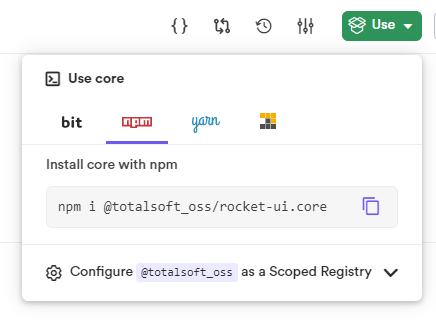

<h1 align="center">Rocket-UI</h1>

<p align="center">
  <a href="https://bit.cloud/totalsoft_oss/rocket-ui">
    
  </a>
</p>

<p align="center">
  <a href="https://bit.cloud/totalsoft_oss/rocket-ui">Bit collection</a>
</p>

> A set of reusable and composable React components built on top of Material UI core for developing fast and friendly web applications interfaces.

> 👨‍🚀 Check the [migration guide](https://app.gitbook.com/o/awVgoXokQ8iqYbJLuD6c/s/I3UNecQp7m3xwC9LeO7G/) from bit legacy to bit harmony version.

## 🛠 Installation

Npmrc is npm config file and in order to use our library, you need to configured this file. 

‼ Skip this step if the project is generated with our [Webapp Rocket Generator](https://github.com/osstotalsoft/generator-webapp-rocket). The .npmrc file is already configured

Run 
```shell 
npm config set @totalsoft_oss:registry https://node.bit.cloud
```

This command will add an entry in your root .npmrc file. If it doesn't exist, it will create one.

### - Installing one component

Go to component main page and then select the command for the package manager that you use. You can also choose the version that you want to install.

<picture>

</picture>

Run the command in your terminal and you'll be ready to use it!
```shell 
npm i @totalsoft_oss/rocket-ui.components.data-display.typography
```

### - Install all components with a single package

If you want to have all the components in your project in just one package. navigate to [core](https://bit.cloud/totalsoft_oss/rocket-ui/core) component in bit cloud.

<picture>

</picture>

Install `core` package by running
```shell
npm i @totalsoft_oss/rocket-ui.core
```

## 👷‍♂️ Usage

```jsx 
    import React from 'react'
    import Typography from '@totalsoft_oss/rocket-ui.components.data-display.typography'
    /* example using core package
    import { Typography } from '@totalsoft_oss/rocket-ui.core'
    */

    const App = () => {
        return (
            <Typography variant='body2' emphasis='bold'>
                "Text"
            </Typography>
        )
    }
```
## 🧬 Components structure

Each component is in a section that is appropriate for its purpose. For example, all buttons related components resides in `buttons` folder.
All components has the same files structure. 
We implement and enforce this structure by creating our own component generator, a functionality provided by Bit.
As you will see, all the components and the ones that will be created using the `rocket-generator` template will have the following structure

<picture>

</picture>

* `index.js`                           Entry file.
* `MyComponent.js`                     Main file.
* `MyComponent.test.js`                Test file.
* `MyComponent.docs.mdx`               Docs file for the component.
* `compositions`                       Compositions folder.
    * `MyComponent.composition.js`     Compositions for simulating the component in different states and contexts.


## 🔧 Contributing guide

 We use [Bit](https://bit.dev/) for components management and contribution. Bit is an open-source tool for composing component-driven software. 

### - Install bit
Is recommended to use Command Prompt instead of Powershell due to some compatibility issues.
```shell 
npm i -g @teambit/bvm
```
```shell
bvm install
```
If any error occurs at installation, please check the [troubleshooting section.](https://bit.dev/docs/reference/using-bvm#troubleshooting)


### - Start local server
After bit is installed successfully, you can clone the repository and use bit functionalities at their fullest.🎆

To get started straight away run in command prompt `bit start` and open [localhost:3000](http://localhost:3000). It may take a while to build the first time you run this command as it is building the whole User Interface for your development environment. When local server is up and running you would see all the components and you can interact with them.

```shell
bit start
```
### - Modify existing components
After changing/fixing the component according to your needs, you should run `bit test` to make sure that all the tests are passing and add more if your changes requires. 
```shell
bit test
```

Also, if a new feature is added, in addition to the tests, an example with the new functionality should also be added. The examples files are in each component directory inside `compositions` directory.

After changing the component you need to run `bit status` to check for bit related issues and then `bit compile` in order to have the latest modifications in your UI.

```shell 
bit status
```
```shell 
bit compile
```

### - Adding a new component
For creating a new component you should use our own component generator, `rocket-generator`, that provides a template which is helpful in implementing a new component.
```shell 
bit create rocket-generator components/buttons/my-component
```
### - Open pull request

When your change/feature/fix is done and you want to mark which components are published, their next version and a changelog message use --soft option.

```shell 
bit tag -m "my message" --soft
```

After running the above command you should see the `bitmap` file changed and after that you can create your pull request.

You can read more about Bit and other functionalitites that he provides [here.](https://bit.dev/docs/quick-start)

## License
rocket-ui is licensed under the [MIT](LICENSE) license. @TotalSoft
